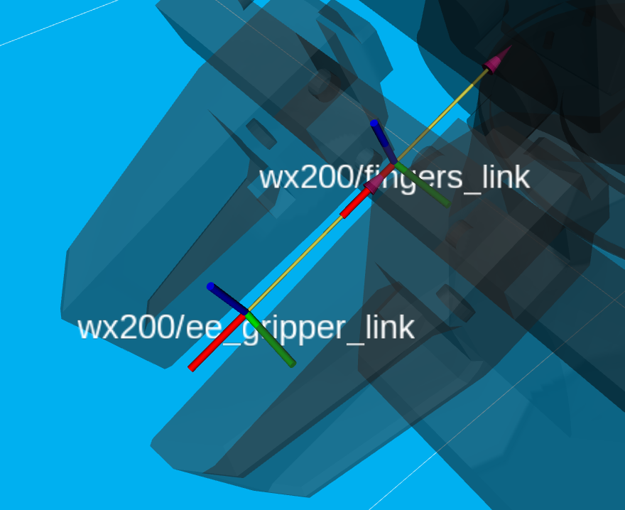

## arm control 

`interbotix_xsarms_control` is the package for connect to robot and estiablish 
https://docs.trossenrobotics.com/interbotix_xsarms_docs/ros2_packages/arm_control.html#usage

reference tf-tree of wx200: 

Seems like the best cad reference point for mounting is the `wx200fingers_link`: 

### torque limit

wx200 doesn't have 

When doing a move through set_ee_pose_matrix to flip the switch, the robot can't provide enough torque.

Force required to flip a switch might be defined by some standard, so we could math it out.

https://www.reddit.com/r/estimation/comments/9tjymd/comment/e8xu08i/?utm_source=share&utm_medium=web3x&utm_name=web3xcss&utm_term=1&utm_content=share_button

## Questions 

trosson perception pipeline? https://docs.trossenrobotics.com/interbotix_xsarms_docs/ros2_packages/perception_pipeline_configuration.html

## Other tips

Motion sequence suggestion for under 6 dof arms.

https://docs.trossenrobotics.com/interbotix_xsarms_docs/python_ros_interface.html#tips-best-practices